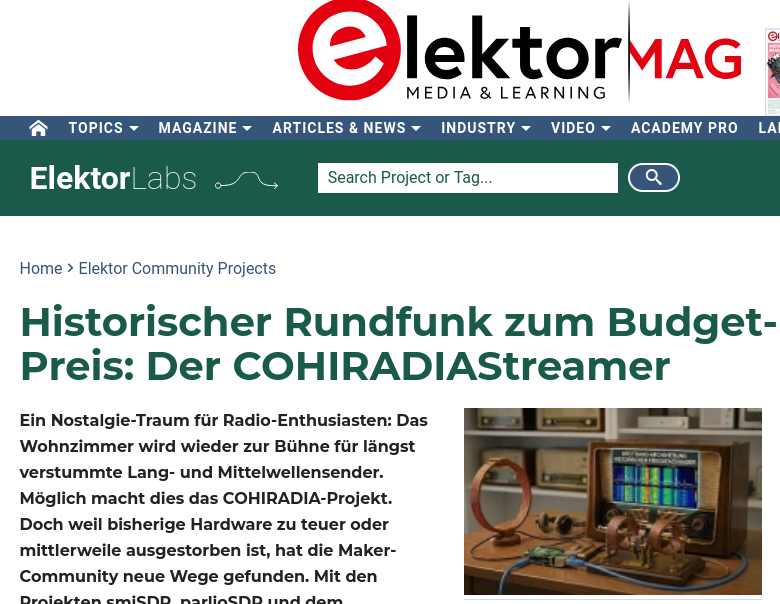

 
 

In [diesem Artikel in der Zeitschrift Elektor](https://www.elektormagazine.com/labs/historischer-rundfunk-zum-budget-preis-der-cohiradiastreamer) wird prominent auf COHIRADIA hingewiesen. Nach einer guten einleitenden Beschreibung unseres Projekts folgt die Darstellung von Alternativen zu den offiziell von COHIRADIA unterstützten Hard- und Softwarelösungen.
Die vorgeschlagenen Tools sind im Kontext der Bereitstellung von kostengünstigen Signalwandlern durchaus interessant. COHIRADIAStreamer und AMWaveSynth werden daher vom COHIRADIA-Team aktuell getestet und wir werden zu gegebener Zeit darüber berichten. Falls jemand Spaß am Experimentieren und einigermaßen gute IT-Kenntnisse (bevorzugt unter LINUX) hat, dann kann dieser Artikel sehr empfohlen werden. Wir freuen uns natürlich auch über Berichte zu erfolgreichen Nachbauten.
