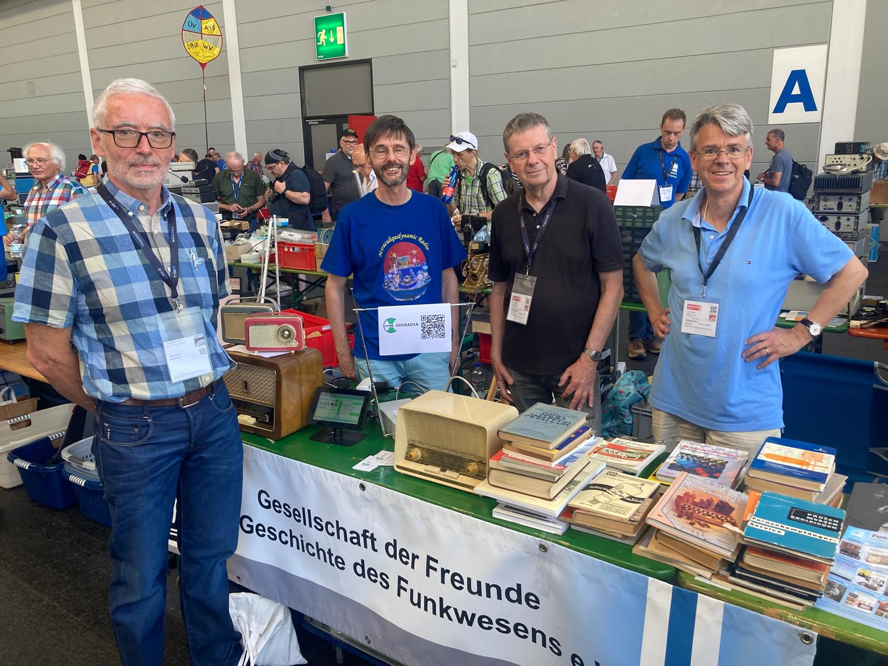
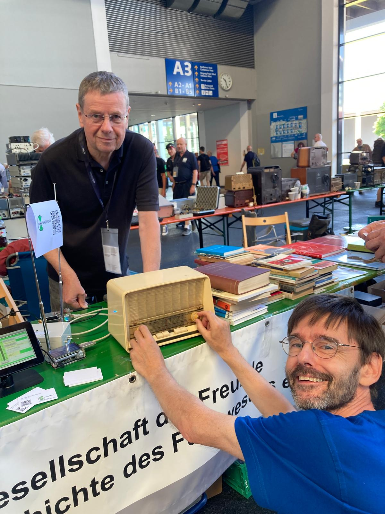
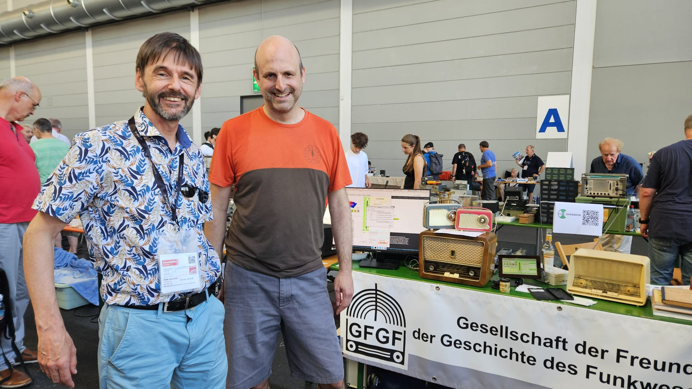
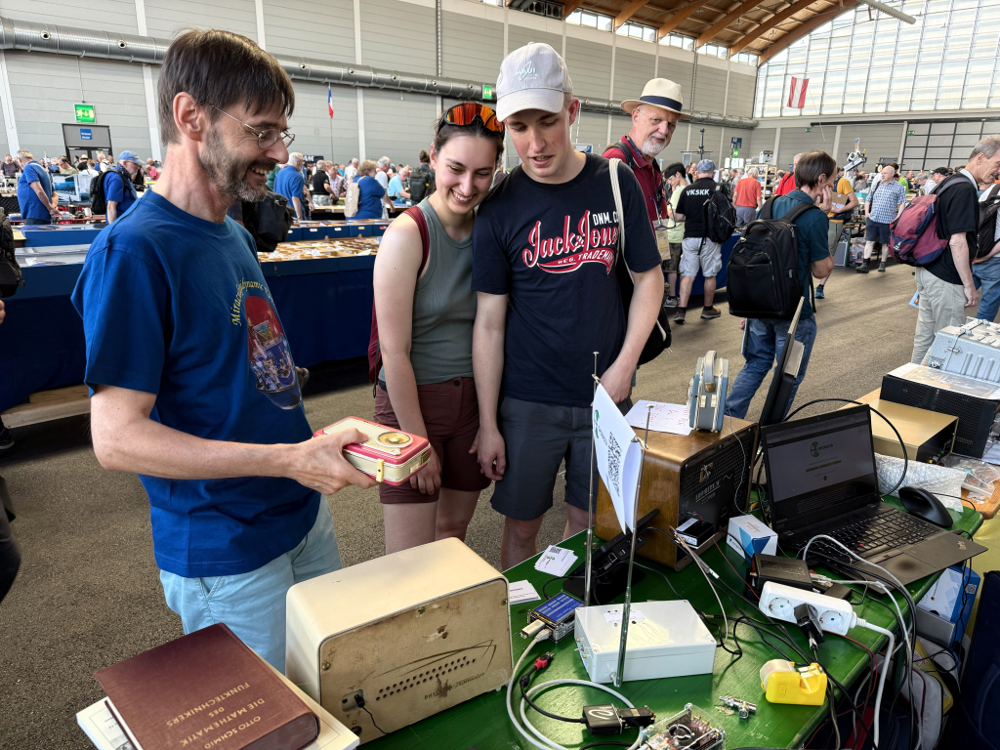
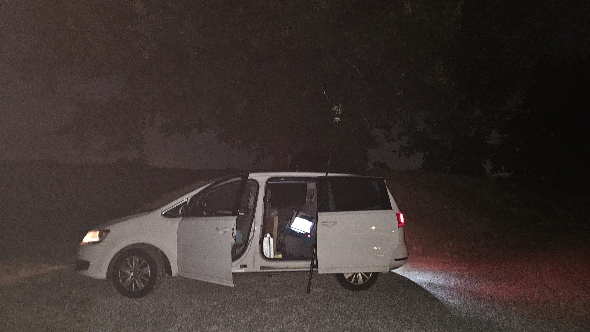
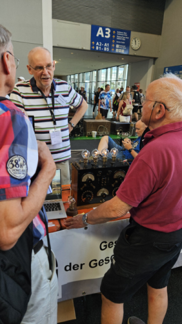
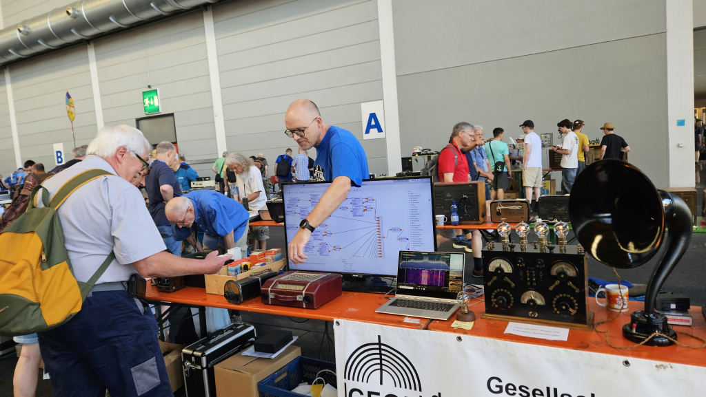

 
(Foto: Ch. Heiner) 

## COHIRADIA erweckte Interesse auf der Ham-Radio 2026

Die Präsentation von COHIRADIA am GFGF-Stand auf der [Ham-Radio](https://www.hamradio-friedrichshafen.de/) in Friedrichshafen (26. - 28. Juni) war sehr erfolgreich. Zahlreiche Interessenten und -innen informierten sich über Hintergrund und technische Ausführung sowie die diversen Implementierungs-Plattformen von COHIRADIA. Die gut strukturierte neue Webpage erwies sich dabei als sehr hilfreich für das schnelle Navigieren auf die relevanten Informationstexte. 

Die gesamte Plattform in allen bisher unterstützten Varianten konnte auf interaktive Weise im Live-Betrieb vermittelt werden, und der Aufbau lud etliche Besucher und Besucherinnen zum aktiven 'Durchkurbeln' durch synthetische und reale AM-Spektren des Archivs ein. Dank an Bernhard Nagel für die Bereitstellung seines Philetta Batterieempfängers, der ausfallsfrei im Dauerbetrieb seine Dienste als magnetisch gekoppeltes Wiedergabegerät leistete. Daneben wurden die Signale auch drahtgebunden auf einer Eumigette W und per Loop auf einem Minerva-Kofferradio aus den 1960ern eingekoppelt. Besonders lebendig konnte ich die Idee von COHIRADIA am 27.6. mit einer erst wenige Stunden alten LW/MW-Breitbandaufzeichnung demonstrieren, die mir nächtens auf einem ungestörten Acker außerhalb von Friedrichshafen mit meiner mobilen SDR-Station gelungen war: Sie beinhaltet die letzten beiden Stunden des Langwellensenders in Droitwich (BBC4) auf 198 kHz, der am 27.06. um 2:00 morgens für immer ausser Dienst genommen worden war.

Wir möchten uns hier auch sehr herzlich beim Team der GFGF (Dirk Becker, Christoph Heiner, Bernhard Nagel, Rüdiger Walz) für die Bereitstellung des Platzes, die sehr nette Zusammenarbeit und viele konstruktive Diskussionen bedanken. Dank auch an Claus-Peter Gallenmiller, der einen Tag lang in der Halle A verbrachte und mich etliche Male am Stand ablöste. Große Freude hat uns der Besuch von Ueli Kurmann bereitet, dem guten Geist hinter den IT-Kulissen unseres Projektes.

Die folgenden Abbildungen vermitteln die Vielfalt der präsentierten Wiedergabesysteme, denn alternativ zur COHIRADIA Plattform konnte man auch den Konzertsender im Zusammenspiel mit einem wunderschönen Vitus von Rüdiger Walz (Bild 6) und die Wiedergabe von über GNU-Radio synthetisierten Spektren auf einem Kofferradio durch Dirk Becker bewundern (Bild 7). 

  

Bild 1: COHIRADIA-Bandscan auf Bernhard Nagels Philetta BD22T (Foto: Ch. Heiner)
  

Bild 3: Besuch von Ueli Kurmann 
  

Bild 4: Auch junges Publikum fand Gefallen an COHIRADIA (Foto: B. Nagel).

  

Bild 5: Nächtliche Aufzeichnung der letzten Stunden von BBC4 auf LW (Foto: H. Scharfetter).

  

Bild 6: Rüdiger Walz spielt MW- und LW-Signale vom Konzertsender auf seinen Vitus Röhrenempfänger ein (Foto: H. Scharfetter).

  

Bild 7: Dirk Becker spielt per GNU-Radio synthetisierte MW- Signale auf seinen Kofferempfänger ein (Foto: H. Scharfetter).

  