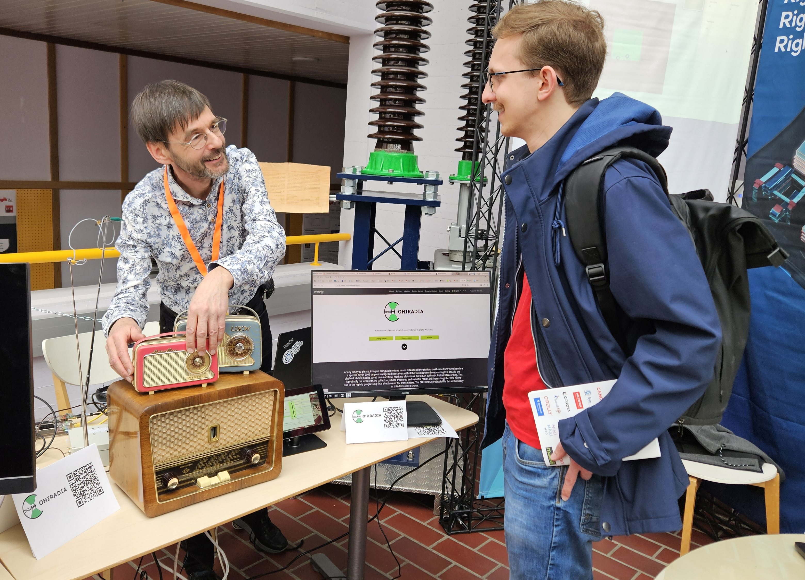
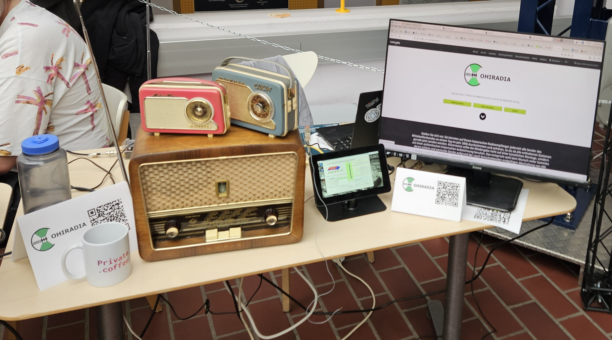
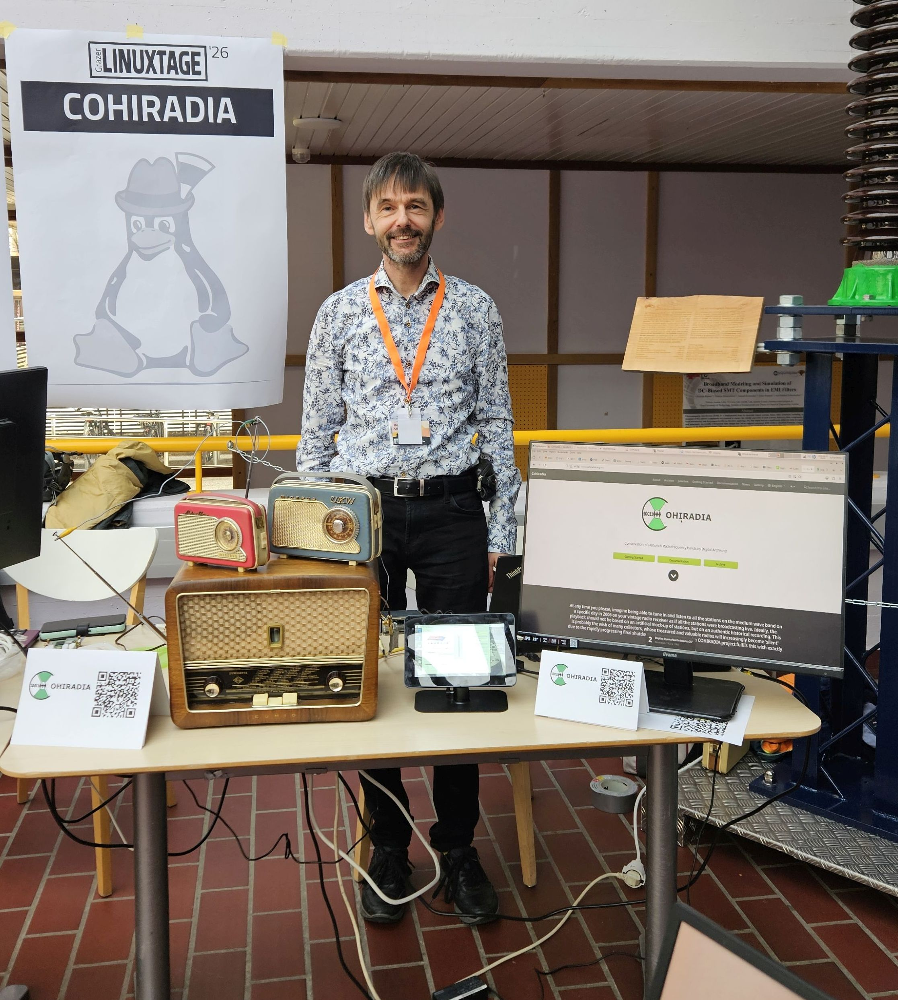

Am 10. und 11. April nahm COHIRADIA an den [Grazer LINUX-Tagen](https://www.linuxtage.at/de/) mit einem [Info-Stand](https://www.linuxtage.at/de/infostaende-2026/#cohiradia) teil. Die Grazer LINUX-Tage bilden die größte österreichische LINUX-Konferenz mit mehreren Hundert Teilnehmern und Teilnehmerinnen. Wer den Stand besuchte, bekam die Möglichkeit, das gesamte COHIRADIA-System
im Betrieb zu erleben. 

  

  
**Die Besonderheit:** Man konnte die Plattform in allen bisher unterstützten Varianten bewundern:

* Klassisches Setup mit PC und COHIWizard
* Miniatur-Version mit dem Raspberry Pi und COHI-Player mini von CP. Gallenmiller. 

Beide Systeme waren zum einen mit einem klassischen Röhrenempfänger aus den 50er-Jahren per Kabel
und andererseits mit zwei Transistor-Kofferradios aus den 1960ern über einen  Loopantennen-Kleinsender gekoppelt.
Als Wiedergabeeinheiten kamen zum einen das Red Pitaya STEMLAB und zum anderen der OSMO-fl2k USB/VGA-Konverter zum
Einsatz. Damit war die gesamte Bandbreite an bisher implementierten COHIRADIA-Systemen auf einmal zu sehen.
  

  

Das Interesse war relativ groß, viele, auch junge Menschen interessierten sich für das System. Das Publikum war sehr gemischt, natürlich waren auch Amateurfunker dabei und alle Teilnehmer und Teilnehmerinnen vereinte das gemeinsame Interesse an LINUX-Anwendungen.

  

