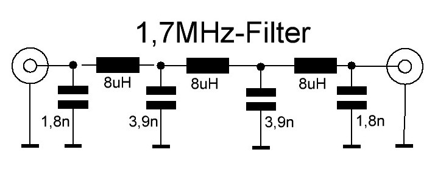
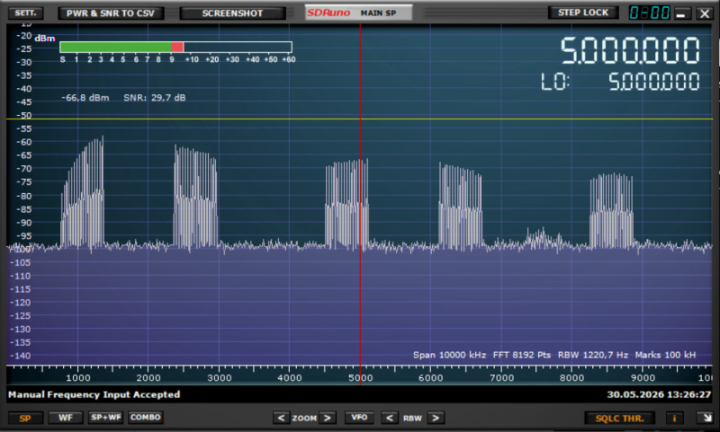
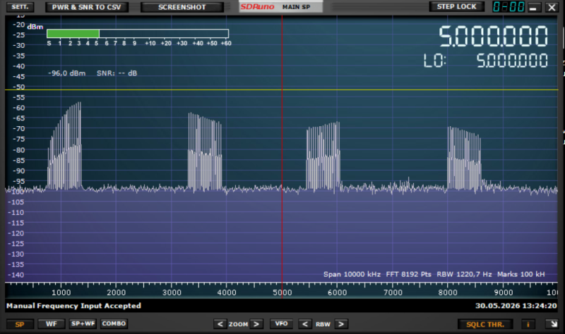
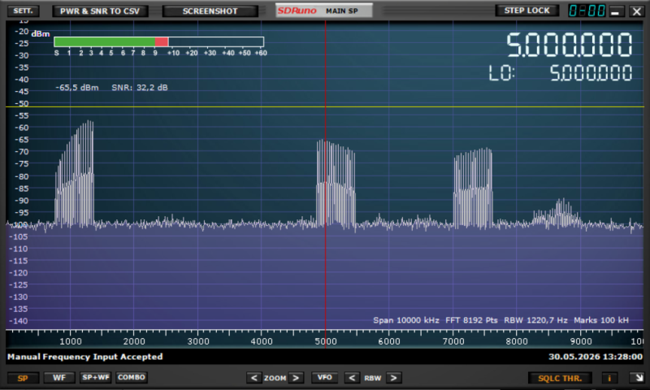
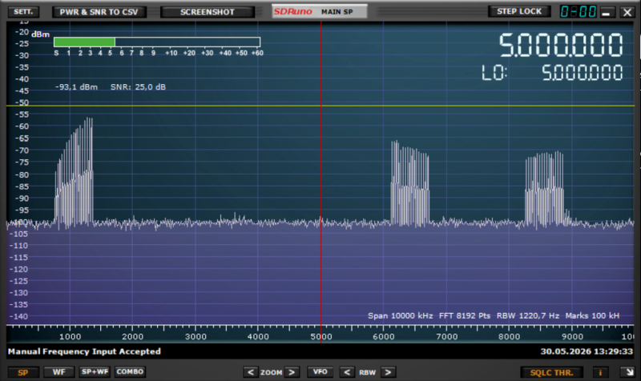

## Erfahrungsbericht zum Einsatz des ADALM2000

T. Nickel berichtete über den Betrieb eines ADALM2000 an einem Windows-PC mit der COHIWizard-Version 2.2.4. Er konnte einige Aufzeichnungen erfolgreich wiedergeben, stellte jedoch bei bestimmten synthetischen Aufnahmen zusätzliches Rauschen sowie Fehlfunktionen der AVC fest. 

Nach einer Problemanalyse wurden mehrere Änderungen vorgenommen, die nun ab Version 2.2.5 zu einer verbesserten Wiedergabequalität führen. Wer noch ältere COHIWizard-Versionen mit einem ADALM2000 benutzt, sollte daher die aktuelle Version downloaden und installieren.

### Identifizierte Probleme

**Rechenleistung**

Wie bereits beim FL2K muss die Hochmischung (Upconversion) der IQ-Basisbanddaten in den Ziel-Frequenzbereich auf dem PC erfolgen, was eine erhebliche Rechenleistung erfordert. Daher können ältere Rechner mit geringer Leistung Paketverzögerungen und periodische Unterbrechungen des Wiedergabestreams verursachen.

In Version 2.2.5 wurde die Datenverarbeitung optimiert, wodurch eine etwas bessere Performance erreicht werden konnte. Dennoch wurden weiterhin Probleme beobachtet, beispielsweise auf älteren Laptops wie etwa einem Toshiba R700 mit einem Intel-i7-Prozessor, 2.6 GHz und 8 GB RAM.

**Alias-Signale am DAC-Ausgang**

Leider verfügt der ADALM2000 am Ausgang seines DACs nicht über passive Antialiasing-Filter. Dadurch erscheinen durch das Upsampling des Originalbandes auf die Abtastrate des AD9963 bei LW- und MW-Wiedergabe Alias-Signale des Nutzbandes im Ausgangsspektrum. Obwohl diese Anteile oberhalb des nominellen oberen Bandendes der wiedergegebenen Frequenbänder liegen, können sie in angeschlossenen Empfängern Störsignale verursachen. Dies führt dann oft zu einem deutlich schlechteren Signal-Rausch-Verhältnis (SNR), als man es von einem 12-Bit-DAC erwarten würde. Leider sind aktuell keine Methoden bekannt, das interne Interpolationsfilter des AD9963 zu aktivieren.

Dieses Problem trat insbesondere bei COHIWizard Versionen bis 2.2.4 auf, da dort die Abtastrate sehr nahe an der doppelten Nyquist-Frequenz gewählt wurde. Um die Images im Spektrum zu unterdrücken, setzte T. Nickel zwischen den Ausgang des ADALM2000 und den Empfänger einen steilflankigen Tiefpass 7. Ordnung, siehe Abb. 1.



**Abb. 1:** Antialias-Tiefpass von T. Nickel

Nach Bekanntwerden dieses Problems wurde daher in Version 2.2.5 des COHIWizard eine Möglichkeit zur Reduktion der Oversampling-Rate des ADALM2000 eingeführt. Dadurch liegt die effektive Abtastrate während der Upconversion höher als in den vorherigen Versionen. Die Alias-Signale werden somit zu höheren Frequenzen verschoben, sodass weniger anspruchsvolle Ausgangsfilter eingesetzt werden können.

**Fazit: Es wird jedenfalls empfohlen, zwischen dem Ausgang des ADALM2000 und den angeschlossenen Empfängern einen externen Tiefpass oder Bandpass vorzusehen.** Für Anwendungen im Mittelwellenbereich (MW) sollte die obere Grenzfrequenz des Filters etwa bei 1,7 bis 1,8 MHz liegen, also am oberen Ende des Mittelwellenrundfunkbandes. Für LW sollte man ein Filter mit Cutoff bei ca 300 kHz vorsehen.

H. Scharfetter erzielte für MW gute Ergebnisse mit einem passiven Butterworth-Bandpass 8. Ordnung. Die Filterparameter wurden mit dem [Chebyshev Bandpass Filter Designer](http://www.changpuak.ch/electronics/chebyshev_bandpass.php) (Version 11. 01. 2014) für ein Chebyshev-Tiefpassfilter mit center-frequency = 1.1 MHz, Bandwidth = 1.2 MHz, Order = 4, impedance = 50 Ohm, passband-ripple = 1%, 'first element' = 'shunt' berechnet. Die resultierende Parametrierung des Filters ist:

Element 1 , Orientation : shunt 
C = 5568 pF, L = 3759 nH
Element 2 , Orientation : series 
C = 2965 pF, L = 7058 nH
Element 3 , Orientation : shunt 
C = 7510 pF, L = 2787 nH
Element 4 , Orientation : series 
C = 4000 pF, L = 5233 nH

Für die Realisierung wurden die jeweils nächstliegenden Werte aus der E12-Reihe benutzt. Anmerkung: Das Setting 'Order = 4' im Calculator bedeutet nicht die tatsächliche Filterordnung, sondern die Anzahl der LC-Paare.

Beide gezeigten Filter müssen mit 50 Ohm abgeschlossen werden, damit sie korrekten Frequenzgang haben. Dies ist bei Anschluss an ein Radio über einen Trenn-Übertrager zu beachten, da man dort von vornherein meist keinen gut definierten Abschluss hat.

**Übersteuerung bei AVC**
Bei einigen synthetisierten Aufnahmen mit hohem Crest-Faktor wurde beobachtet, dass es zu starkem Rauschen und unbrauchbarer Wiedergabe kommt, wenn die AVC (automatic volume control) des COHIWizard aktiviert ist. Die Ursache ist nicht vollständig geklärt, ist aber im ADALM2000 selbst zu suchen. Deaktivieren der AVC und manuelles Herunterregeln des 'volume' hilft hier weiter. Ab Version 2.2.5 wird bei hohem Crest-Faktor im Signal automatisch der AVC-Threshold abgesenkt und somit sollte der Fehler normalerweise nicht mehr auftreten.


### Konkrete technische Lösung für das Aliasing-Problem: Anpassung des Oversampling-Faktors

Falls bei der Wiedergabe bestimmter Aufzeichnungen weiterhin Störungen, beispielsweise starkes Rauschen, auftreten, kann es erforderlich sein, einen Parameter in der Datei *config_wizard.yaml* manuell anzupassen.

Der ADALM2000 arbeitet mit einer festen Abtastrate von 75 MS/s. Für eine Bandbreite von beispielsweise 1,8 MHz wären theoretisch mindestens 3,6 MS/s erforderlich, um das Nyquist-Kriterium zu erfüllen. Diese Abtastrate sollte für geringe Rechenlast und Datenübertragungsrate möglichst niedrig gewählt werden. Die Software ermittelt daher automatisch den kleinsten ganzzahligen Teiler, durch den die interne Abtastrate von 75 MS/s dividiert werden kann, ohne das Nyquist-Kriterium zu verletzen. Dieser Teiler wird als *Oversampling Ratio* (OSR) bezeichnet.

Im vorliegenden Beispiel ergibt sich damit eine Abtastrate von 3,75 MS/s, entsprechend einem OSR-Wert von 20. Das Signal wird damit effektiv um den Faktor 20 überabgetastet. Allerdings erscheint die erste Alias-Komponente eines auf 1.8MHz begrenzten Bandes dann bereits bei 1,95 MHz und damit nur 150 kHz oberhalb des Bandendes.

Ein Beispiel mit Bandgrenze bei 1.4 MHz zeigt Abb. 3, wo das Spektrum einer synthetischen Aufzeichnung bis 10 MHz dargestellt ist.



**Abb. 3:** Spektrum einer Aufzeichnung (Bandende 1.4 MHz) mit allen Aliases bis 10 MHz.

Die untere Grenze der ersten Alias-Komponente liegt damit bei:

3.75 - 1.4 = 2,35 (MHz)

Zur ausreichenden Unterdrückung dieser Alias-Signale wäre auch noch ein sehr steilflankiger Filter erforderlich. Deshalb wurde ein sogenannter *Relaxation Factor* (*relaxfactor_OSR*) eingeführt, der die OSR auf einen entsprechend kleineren ganzzahligen Wert reduziert.

Dieser Faktor ist im File *config_wizard.yaml* einstellbar:

```yaml
relaxfactor_OSR: 1.2
```

Standardmäßig ist dieser Faktor auf 1.2 gesetzt. Daraus ergibt sich ein OSR-Wert von 16.7, der auf den nächstniedrigen ganzzahligen Wert 16 trunkiert wird. Damit ergibt sich dann eine Basis-Samplingrate von 4.6875 MS/s.

Für das obige Beispiel gilt:

4.6875 − 1.4 = 3.2875 (MHz)

Der erste Alias beginnt also bei knapp 3.3 MHz, wie Abb. 4 zeigt. Damit bekommt man etwas mehr Reserve für die Dämpfung der unerwünschten Signalanteile nach dem Tiefpass.




**Abb. 4:** Spektrum einer Aufzeichnung (Bandende 1.4 MHz) mit allen Aliases bis 10 MHz. Hier wurde OSR auf 16 gesetzt (relaxfactor_OSR = 1.2)

Je größer der Wert von *relaxfactor_OSR* gewählt wird, desto geringer ist die Überabtastung und desto weiter werden die Aliases zu höheren Frequenzen verschoben, was deren Ausfilterung natürlich erleichtert. Gleichzeitig steigen jedoch der Rechenaufwand für das Upsampling sowie die erforderliche Datenübertragungsrate. Daher werden Werte deutlich größer als 1,5 bei durchschnittlichen PC-Leistungen nicht empfohlen. Auf einem PC mit AMD Ryzen Pro 4650G mit 3,7 GHz und 16GB RAM konnte unter Windows11 bis zu einem Wert von 1.6 unterbrechungsfrei übertragen werden.

Beispiele für 1.5 und 2.0 sind in Abb. 5 zu sehen.




**Abb. 5:** Spektren einer Aufzeichnung (Bandende 1.4 MHz) mit allen Aliases bis 10 MHz bei OSR = 13 (oben) und 10 (unten) (entsprechend relaxfactor_OSR = 1.5 bzw. 2.0). Man beachte die zunehmende Verschiebung der Aliases zu höheren Frequenzen. 

**ACHTUNG:** Normalerweise sollte die datei *config_wizard.yaml* nicht verändert werden. Dort speichert der COHIWizard nämlich wichtige Einstellungen und auch z.B. die zuletzt verwendeten Dateipfade und z.B. die IP-Adresse des STEMLAB. Unkontrollierte Veränderungen können evt. zur Funktionsunfähigkeit des COHIWizard führen. Machen Sie daher vor Veränderungen immer eine Sicherungskopie dieser Datei, um sie ggf. wiederherstellen zu können, falls etwas schief geht. Im Notfall kann man sie auch löschen, dann wird bei Neustart eine neue Version angelegt. Allerdings gehen die bisherigen Einstellungen dann verloren.

**Anmerkung:** Auf Rechnern mit geringer Leistungsfähigkeit können selbst bei einem Wert von 1,2 noch Aussetzer oder Unterbrechungen im Signalstrom auftreten. In diesem Fall kann als kleinster zulässiger Wert

```yaml
relaxfactor_OSR: 1.0
```

verwendet werden. Allerdings ist dann ein sehr steilflankiges Ausgangsfilter erforderlich, um die Alias-Komponenten ausreichend zu unterdrücken.

Das COHIRADIA-Team bedankt sich herzlich bei T. Nickel für die tatkräftige Unterstützung bei der Problemanalyse.

---
