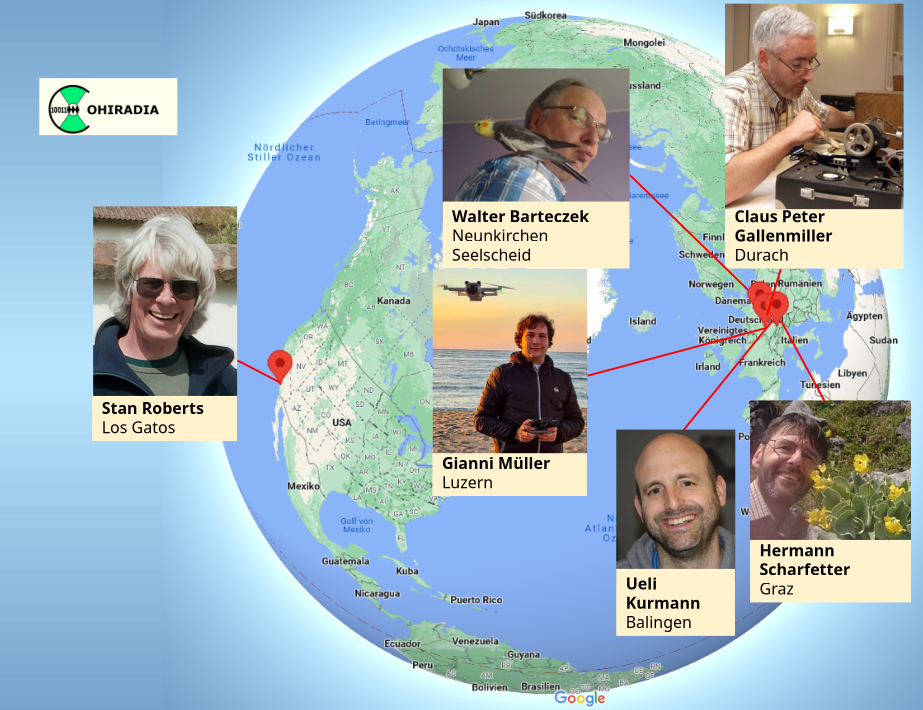

## Introduction

Imagine being able to tune in and listen to all the stations on the medium wave band on a specific day in 2006 on your vintage radio receiver at any time, as if all the stations were broadcasting right now. 
Ideally, the playback should not be based on an artificial montage, but on an authentic historical recording. This is probably the wish of many collectors, whose beautiful and valuable devices will increasingly remain 'silent' due to the rapidly progressing final shutdown of AM transmitters. The COHIRADIA project fulfills exactly this wish, as this (somewhat outdated) 
[Demo Video](https://cohiradia.radiomuseum.org/download/COHIRADIA_Demovideo_v1.mp4) shows.

COHIRADIA stands as an acronym for **CO**nservation of **HI**storical **RA**diofrequency bands by **DI**gital **A**rchiving.

## Goals
COHIRADIA essentially pursues three goals:

1. To give interested radio enthusiasts and collectors the opportunity to play back original radio signals on vintage radio receivers that were recorded in the past. These signals should not only contain a single station, but an entire frequency band (e.g., medium wave) with all the broadcast stations it contains at the correct carrier frequencies that existed at the time of recording. This allows all stations to be tuned again on the radio receiver.

2. To record current broadcast bands, especially in the AM range, at various locations worldwide, in order to capture the still existing landscape of active transmitters in archive files in time, before the technology has completely died out.

3. To create artificial broadcast bands that allow the simulation of programs as they existed, for example, in the early days of broadcasting, for which no recordings exist. See the [COHI Jukebox](../archiv/jukebox) section for this.

## Contact
The project coordinator of COHIRADIA is Hermann Scharfetter. As a member of rmorg, you can contact him via his [profile](https://www.radiomuseum.org/dsp_profile.cfm?Member_Id=3642), or as a guest via [email](mailto:hermann.scharfetter@gmail.com) to ask questions, propose your own recordings for the archive, or to further develop the project together with him.

## COHI Jukebox

Unfortunately, there are practically no original recordings of broadband RF signals in the COHIRADIA sense, especially from the early days of broadcasting up to the 80s.
However, it would be desirable to be able to play back signals on, for example, radio devices from the 20s to 50s that at least fit the content of these devices. The section 

* [COHI Jukebox](../archiv/jukebox)

attempts to approach this topic by providing synthetic AM bands in the long and medium wave range that have modulated content and music of that era onto a variety of common carrier frequencies.

## The founding team

