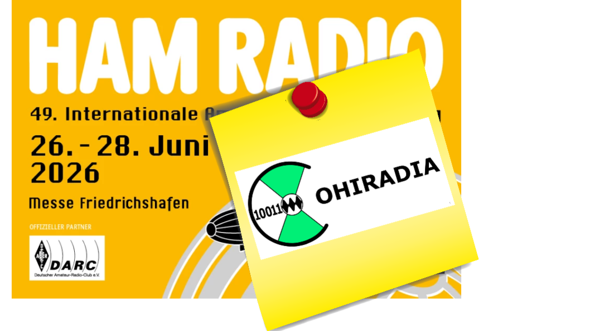

## We are at the HAM RADIO 2026

From June 26 to 28, 2026, COHIRADIA will be participating in the [HAM RADIO](https://www.hamradio-friedrichshafen.de/) in Friedrichshafen. The project will be on display (and audible) at the GFGF booth, which has kindly provided us with space there ([Hall A3, Booth 17](https://www.gfgf.org/de/veranstaltungen.html)). So if you have the time and interest, this event offers you the opportunity to experience the entire platform in action across all currently supported variants, just as was the case [at the Linux Day in Graz](https://www.cohiradia.org/en/blog/2026/02/18/cohiradia-participates-in-linux-days-graz/):

(1) Classic setup with PC and COHIWizard  
(2) Compact version with the [Raspberry Pi 5](https://cohiradia.radiomuseum.org/download/docs/ressources_webpage/Raspi5_COHIRADIA_Demo_1_20260208_144840.mp4), COHIWizard and COHI-Player mini by Claus Peter Gallenmiller.   
(3) Miniature version with the [Raspberry Pi 4](https://www.radio-bastler.de/forum/index.php?thread/29054-cohiradia-vorf%C3%BChrung-in-berlin/&postID=318069#post318069) and COHI-Player mini by Claus Peter Gallenmiller. 

All systems are demonstrated there using, on the one hand, a classic tube receiver from the 1950s via cable and, on the other hand, a transistor portable radio from the 1960s via a [small loop antenna](https://cohiradia.radiomuseum.org/download/docs/ressources_webpage/Gallery/Wiedergabebeispiele/minerva_ukw_rahmenantenne_COHIRADIA.mp4). 

The playback devices used will be the Red Pitaya STEMLAB and the affordable OSMO-fl2k USB/VGA converter. 
    
This will allow visitors to see the entire range of COHIRADIA systems implemented to date all at once. So if anyone wants to get firsthand information, this is the perfect opportunity.

