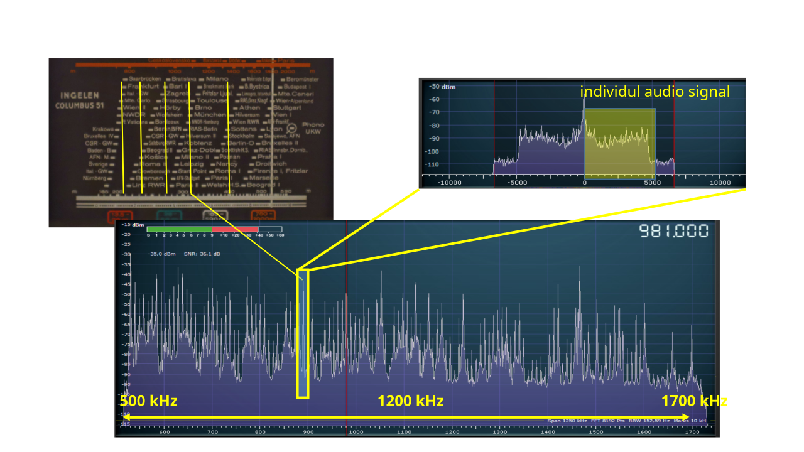
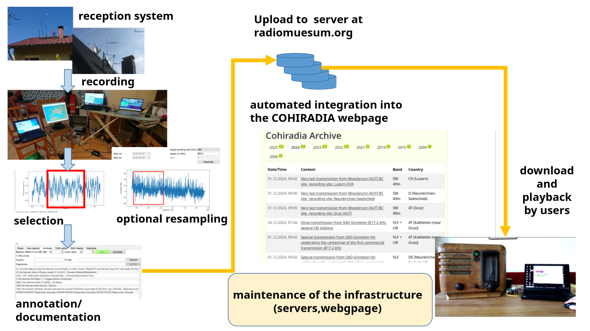
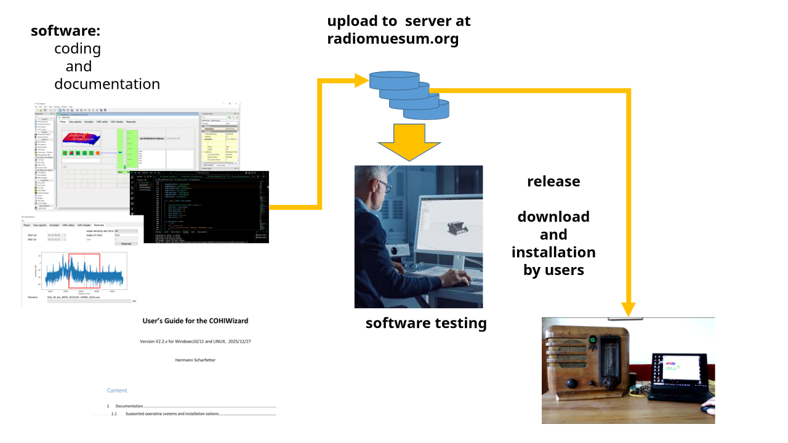
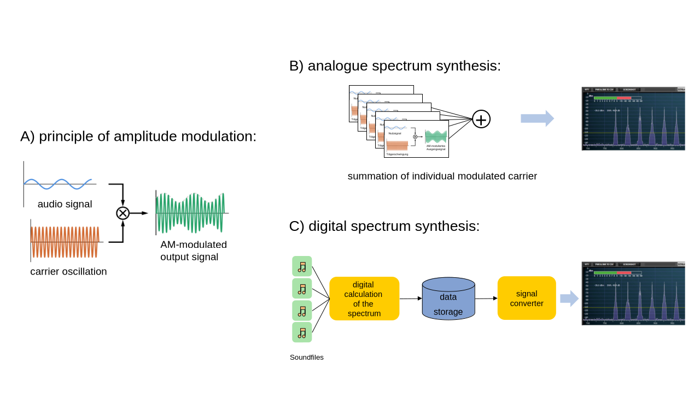

## Recording and Playback of 'Natural' Broadband Spectra

**If you prefer a video on the topic, just watch this one:**



**If you prefer text, please continue reading here:**

Basically, a variety of stations are present simultaneously in the electromagnetic spectrum. In the medium wave band, with a 9 kHz channel spacing, this can be almost 130 stations. Each station is assigned a carrier frequency. In contrast to audio signals, where only one sound source is recorded on one (mono) or two (stereo) channels, many audio signals are present simultaneously in a band, being modulated onto their respective carrier frequencies. This is schematically shown in Fig. 1: Each station that can be set on the radio dial (top left) corresponds to a peak in the entire MW spectrum, here between 500 and 1700 kHz (bottom). The broadcast receiver selects exactly the 'peak' that corresponds to the set station (top right) and demodulates the signal. Thus, only one channel is audible, although of course all are still present at the antenna input simultaneously.

*Fig. 1: Stations and their signals in the entire MW spectrum* 

If you want to offer the radio an adequate antenna signal that once existed in the past, you must have recorded the entire spectrum in its full width at that time in the past. This means a bandwidth of at least 1200 kHz instead of 2x 20 kHz for audio. Such broadband recordings can nowadays be made with special signal converters, so-called software-defined radios (SDR).

The entire recording pipeline is shown in Fig. 2: First, the AM signals are received via low-noise broadband antennas, optionally broadband preamplifiers ("systems"), digitized with SDRs, and stored on hard drives ("recording"). After that, the recordings are evaluated for quality and resampled if necessary. If they are considered suitable for the archive, the individual stations in the band are identified and annotated if possible. They are then uploaded to the COHIRADIA server. From there, any interested person can download them.

*Figure 2: Recording and processing of broadband antenna signals for the archive* 

To play back these signals, suitable software is required in addition to playback-capable signal converters that send the signals to them. Such software is continuously programmed, tested, and developed by members of the COHIRADIA team. Fig. 3 shows the software development pipeline schematically. Alternative projects have also been initiated outside of COHIRADIA by radio enthusiasts with, e.g., GNU Radio.

*Figure 3: Providing software for playback on analog radios.*

## Artificial Generation of Broadband Spectra (Synthesis in the Sense of the Jukebox)

As already described in the previous chapter, the electromagnetic signal transmitted by an AM transmitter consists of a sinusoidal carrier oscillation at the nominal transmission frequency fT and the useful signal, which is imposed on this carrier oscillation as an amplitude variation (see Fig. 4 A). If you want to artificially generate such a signal, you basically have two options:

1. Modulation of an analog signal generator with an audio signal
2. Digital synthesis on a computer from digital audio sources (e.g., wav, mp3, or similar) followed by digital-to-analog conversion (DAC).
   
If you want to generate a complete spectrum with many coexisting stations, you must combine individual signals. In case 1 (analog), you must add together several individual signals generated according to (1) with different carrier frequencies, see Fig. 4 B. In case 2 (digital), the signals of the individual transmitters are calculated from the respective audio files and then added. These sum signals are stored and provided in the same data format as directly recorded antenna signals (see Fig. 4 C). During playback, D/A conversion via the signal converter follows again.

*Figure 4: A: Principle of amplitude modulation. B: Generation of a spectrum by connecting analog modulators together. C: Generation of a spectrum by digital synthesis.* 

<!-- comment -->